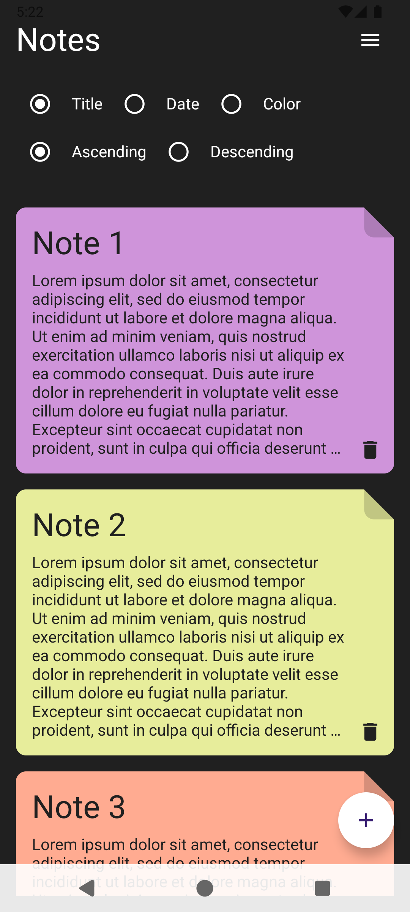
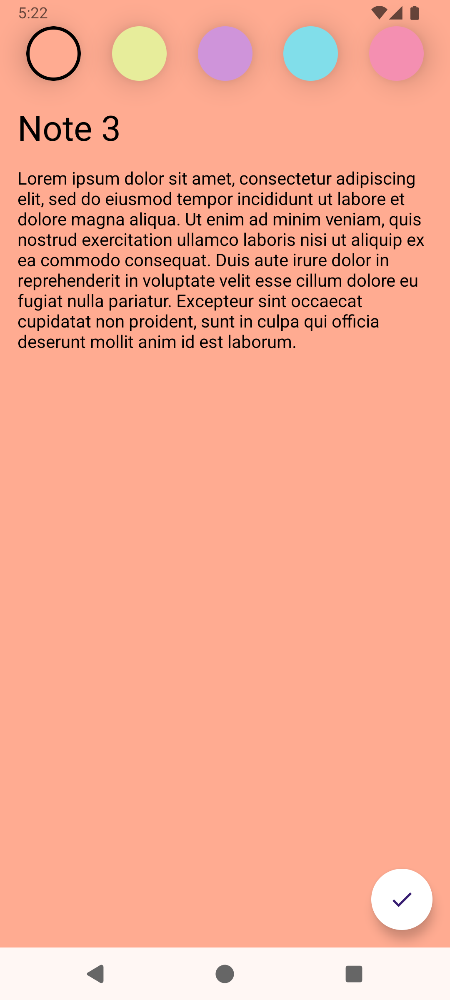

## Overview
Simple Notes app (similar to Google Keep) where users can create, update and delete notes that are saved on Android local database.

 

  
&nbsp; &nbsp; &nbsp; &nbsp;
  

## Tech Stack
- Usecases: CRUD (Create, Read, Update and Delete)
- Programming Language: Kotlin
- Ui development: Android Jetpack Compose
- Dependency Injection: Hilt + Dagger
- Persistance: Room Database
- Asynchronous requests: Coroutines + Flow
